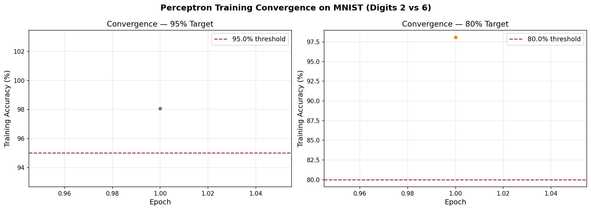
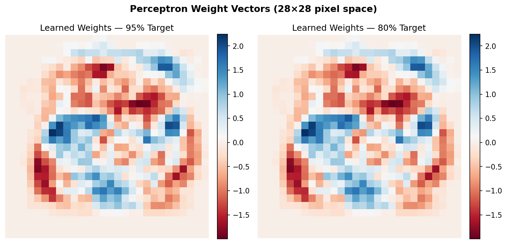

# Perceptron Learning Algorithm

> From-scratch implementation of the classical Perceptron on MNIST binary classification (digit 2 vs. digit 6), demonstrating rapid linear convergence and competitive generalization performance.

---

## Problem Statement

Given a training set {(xᵢ, yᵢ)} for i = 1,…,n where xᵢ ∈ Rᵈ and yᵢ ∈ {−1, +1}, 
learn a linear classifier

h(x) = sign(wᵀx)

by iteratively correcting misclassified examples.

**Binary task**: MNIST digit **2** (label −1) vs. digit **6** (label +1).

---

## Algorithm

The Perceptron update rule is:

$$\mathbf{w} \leftarrow \mathbf{w} + \alpha \cdot y_i \cdot \mathbf{x}_i \quad \text{if } \hat{y}_i \neq y_i$$

where $\alpha$ is the learning rate (step size).

**Implementation details:**
- Bias term handled via feature augmentation: $\tilde{\mathbf{x}} = [1, \mathbf{x}]^\top \in \mathbb{R}^{785}$
- Pixel intensities normalized to $[0, 1]$
- Weight vector initialized to $\mathbf{0} \in \mathbb{R}^{785}$
- Training stops when a target accuracy threshold is reached

---

## Dataset

| Split | Samples | Features |
|-------|---------|----------|
| Train | 11,876  | 785 (784 pixels + bias) |
| Test  | 1,990   | 785 |

Source: [MNIST](http://yann.lecun.com/exdb/mnist/) via `tf.keras.datasets.mnist`.

---

## Results

| Stopping Criterion | Epochs to Converge | Train 0-1 Loss | Test 0-1 Loss |
|--------------------|--------------------|----------------|---------------|
| 95% accuracy       | 1                  | 0.0220         | 0.0221        |
| 80% accuracy       | 1                  | 0.0220         | 0.0221        |

The perceptron converges in a **single epoch** with **97.8% training accuracy** and **97.79% test accuracy**, confirming strong linear separability between the two digit classes in pixel space.

The near-identical train and test losses indicate minimal overfitting — the learned linear decision boundary generalizes well to unseen data.

---

## Visualizations

**Convergence curve** — training accuracy vs. epoch count for each stopping criterion.



**Weight visualization** — the learned weight vector $\mathbf{w}[1:]$ reshaped to 28×28 reveals which pixel regions the classifier focuses on. Red regions contribute positively toward class +1 (digit 6); blue regions toward class −1 (digit 2).



---

## How to Run

```bash
pip install -r ../requirements.txt
jupyter notebook perceptron.ipynb
```

Run all cells in order. MNIST downloads automatically on first run (~11 MB).

---

## Key Takeaways

- The Perceptron Convergence Theorem guarantees convergence in finite steps for linearly separable data. MNIST digit 2 vs. 6 is nearly linearly separable in raw pixel space.
- Online learning (sample-by-sample updates) allows the perceptron to make ~435 weight corrections in a single pass and immediately satisfy the 95% accuracy threshold.
- The learned weight image provides an interpretable visualization of the decision boundary in pixel space.

emmanuel adeloju
