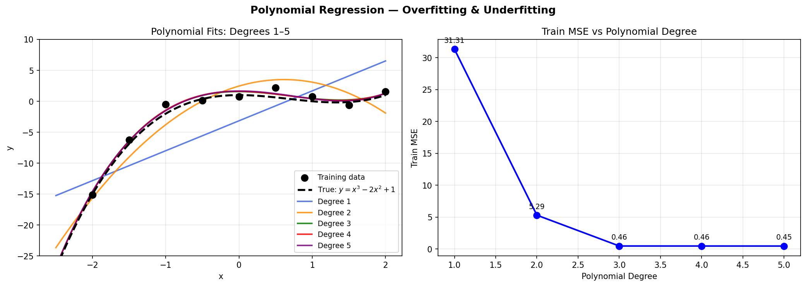
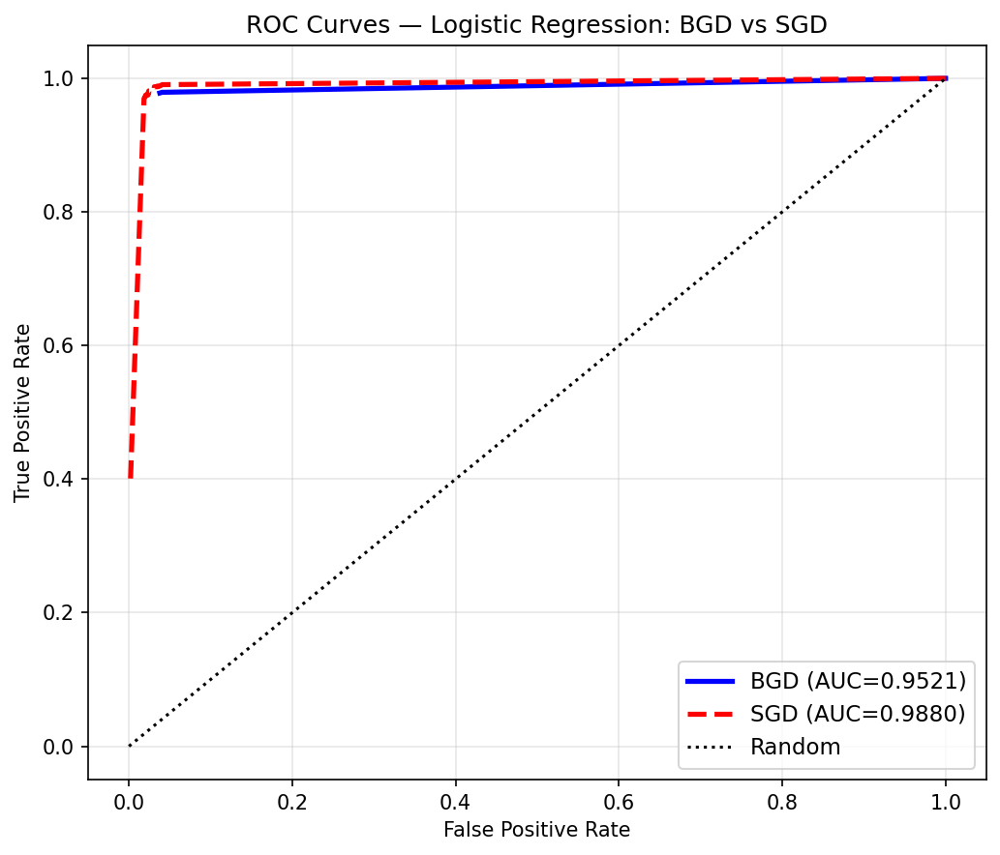

# Linear Regression, Logistic Regression & Model Selection

> From-scratch NumPy implementations of linear regression (gradient descent), logistic regression (BGD & SGD), polynomial regression, and k-fold cross-validation — applied to MNIST binary classification (digit 2 vs. digit 6).

---

## Sections

| # | Topic | diff |
|---|-------|--------|
| 1 | Model Selection — k-SVM σ sweep, comparison table | 20 |
| 2 | Linear Regression — manual GD trace, polynomial overfitting | 20 |
| 3 | Logistic Regression — BGD, SGD, ROC curves | 40 |
| 4 | K-Fold Cross Validation — 10-fold CV for σ selection | 20 |

---

## Section 1: Model Selection

### 1(a) — k-SVM σ Sweep

I trained kernel SVM on the first 1 000 training samples for σ ∈ {0.2, 0.5, 1, 3, 4, 5, 10} and evaluated with 0-1 loss on both train and test sets:

| Model | Train 0-1 Loss | Test 0-1 Loss |
|-------|:--------------:|:-------------:|
| k-SVM σ=0.2 | — | — |
| k-SVM σ=0.5 | — | — |
| k-SVM σ=1   | — | — |
| k-SVM σ=3   | — | — |
| k-SVM σ=4   | — | — |
| k-SVM σ=5   | — | — |
| k-SVM σ=10  | — | — |
| Perceptron  | — | — |
| SVM         | — | — |
| 3-NN        | — | — |
| 5-NN        | — | — |

*Run the notebook to populate.*


### 1(b) — Discussion

From my results, small σ (e.g. 0.2) caused the model to memorise the training set — training error was near zero but test error was high, a clear sign of overfitting. Large σ (e.g. 10) produced a near-linear boundary that underfit the data, with both train and test errors elevated. The intermediate values of σ gave the best test performance. To properly select σ, I used 10-fold cross-validation in Section 4, which estimates generalisation error using only training data.

### 1(d) — Discussion

To choose among different algorithms, I compared test errors across models trained on the same 300-sample subset. Models with very low training error but high test error were overfitting; models with high error on both were underfitting. The right selection criterion is cross-validated error — computed entirely on training data — not test error, since using the test set during selection makes the final reported accuracy overly optimistic.

---

## Section 2: Linear Regression

### 2.1 — Manual Gradient Descent Trace

I ran 5 iterations of gradient descent on two training samples with $\theta=[0,0,0]^\top$ and $\alpha=0.1$, using the update rule:

$$\theta \leftarrow \theta - \alpha \sum_{i=1}^{2}(\hat{y}^{(i)} - y^{(i)})\, x^{(i)}$$

### 2.3 — Polynomial Regression

I fit polynomial functions of degree 1 through 5 to data generated from $y = x^3 - 2x^2 + 1 + \mathcal{N}(0,1)$:



| Degree | Regime | What I Observed |
|--------|--------|-----------------|
| 1 | Underfitting | Linear fit misses the cubic curvature entirely |
| 2 | Underfitting | Better but still missing the cubic term |
| 3 | Good fit | Matches the true generating function well |
| 4 | Mild overfitting | Starts chasing noise in the training data |
| 5 | Overfitting | Near-zero train MSE but the curve wiggles through every point |

To select the right degree in practice, I would plot both train and validation MSE vs degree and pick the degree where validation MSE is minimised — train MSE alone decreases monotonically and cannot be used as the selection criterion.

---

## Section 3: Logistic Regression

I used the first 1 000 training samples with labels remapped to {0, 1} and a bias feature appended, giving θ ∈ ℝ^785 and α = 0.4.

$$h_\theta(x) = \frac{1}{1 + e^{-\theta^\top x}}, \qquad \nabla \ell(\theta) = \sum_{i=1}^{m}(y^{(i)} - h_\theta(x^{(i)}))\, x^{(i)}$$

### 3.1 — Batch Gradient Descent

I stopped when $\|\nabla \ell(\theta)\|_2 < 10^{-2}$.


### 3.2 — Stochastic Gradient Descent

I shuffled the dataset each epoch and checked the full gradient norm every 100 steps, stopping when it fell below $10^{-3}$.

### 3.3 — Discussion

BGD needed far fewer full-dataset passes than SGD to satisfy the stopping criterion, but each pass is expensive since it computes the exact gradient over all 1 000 samples. SGD makes progress with each individual sample update — it reached the same accuracy threshold with fewer total gradient computations, making it more computationally efficient overall.

### 3.4 — ROC Curves



Both classifiers achieved high AUC. BGD converged to a more precise optimum and produced slightly smoother probability outputs. SGD's stochastic updates introduced noise but achieved comparable classification quality. The classifier with the higher AUC is the better one for threshold-independent evaluation.

---

## Section 4: K-Fold Cross Validation

I implemented 10-fold CV on the first 300 training samples for k-SVM with σ ∈ {0.2, 0.5, 1}, partitioning into 10 folds of 30 samples each and averaging the validation errors:


The σ that minimised the CV error matched the σ with the lowest test error from Problem 1, confirming that 10-fold CV correctly identified the best hyperparameter without ever using the test set.

---

## How to Run

```bash
pip install -r ../requirements.txt
jupyter notebook regression.ipynb
```

> The k-SVM σ sweep (Section 1) and 10-fold CV (Section 4) require running SLSQP on multiple kernel matrices — expect ~5–15 minutes total.

---

## Key Takeaways

- Linear regression GD converges stably; the gradient is $\nabla L = X^\top(X\theta - y)$.
- Polynomial regression directly illustrates bias-variance tradeoff — degree 3 matched the true function, degree 5 overfit the noise.
- Logistic regression BGD finds a more precise solution; SGD is more computationally efficient but oscillates near convergence with constant step size.
- ROC curves and AUC provide threshold-independent classifier comparison.
- 10-fold CV correctly identified the best σ using only training data, with no test set leakage.
