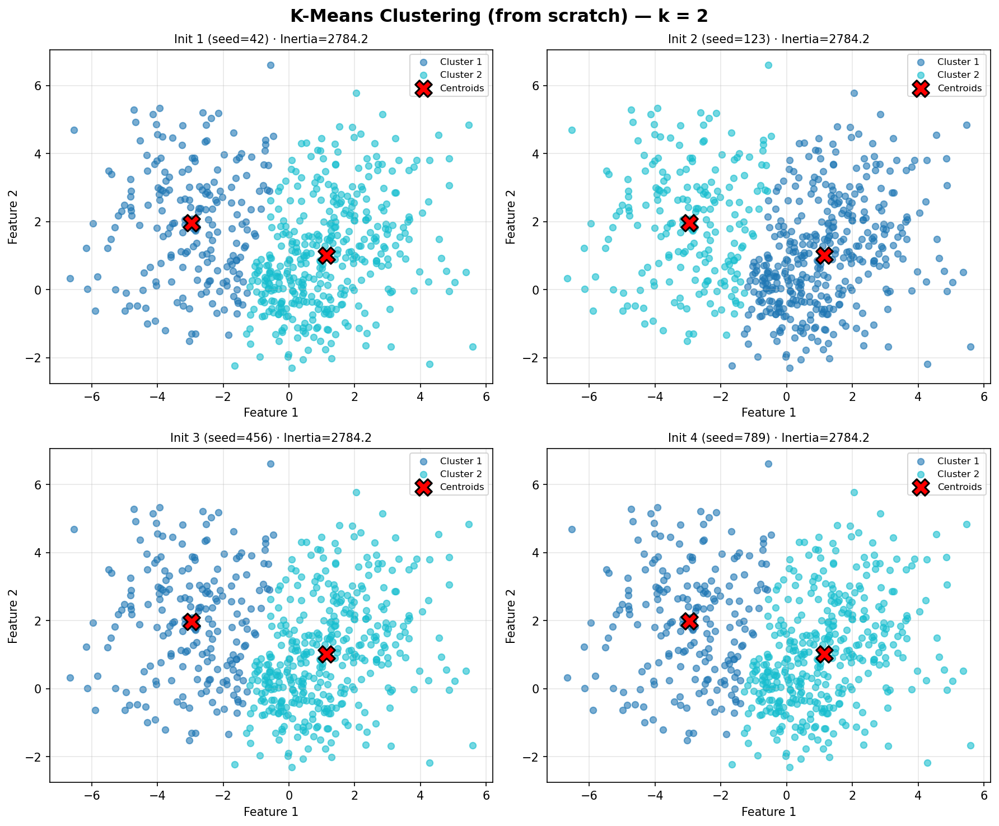
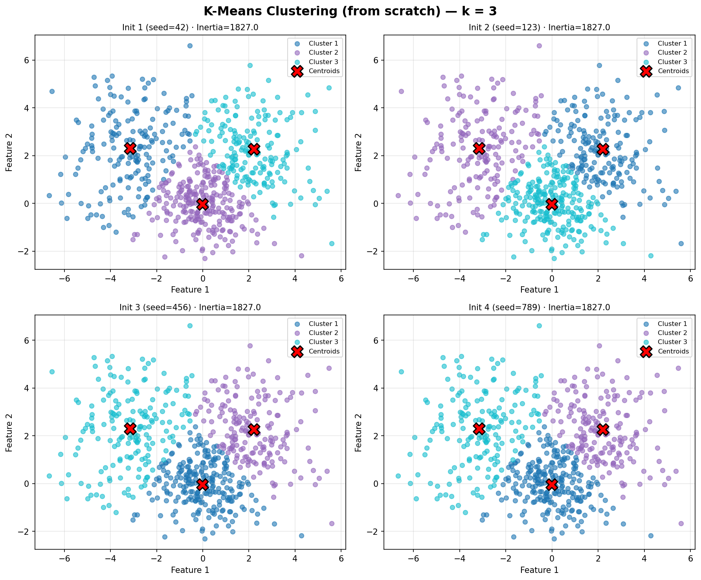
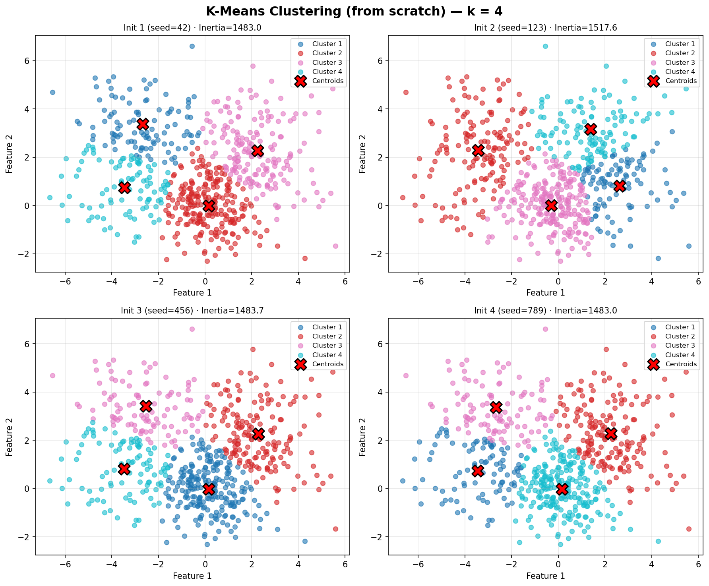
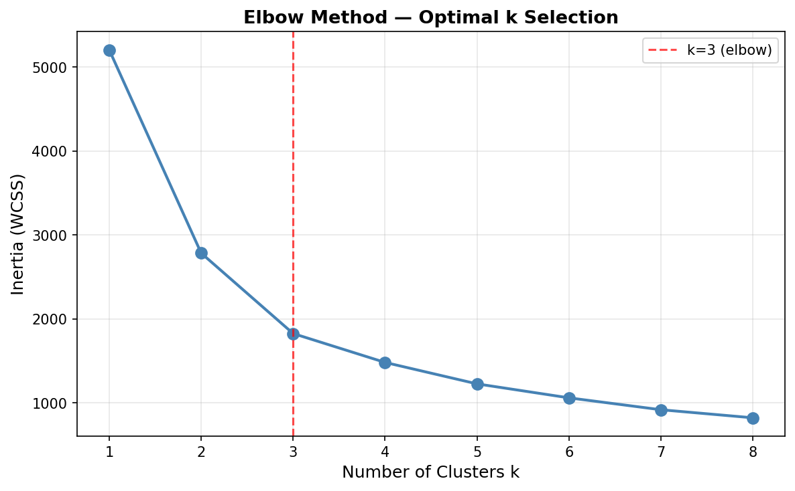
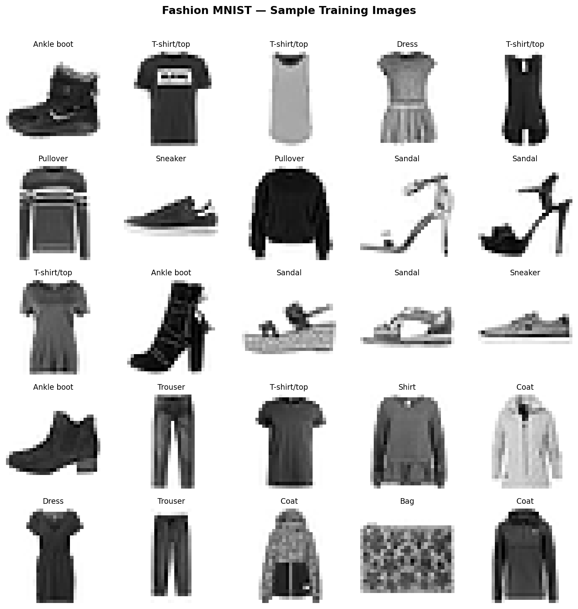
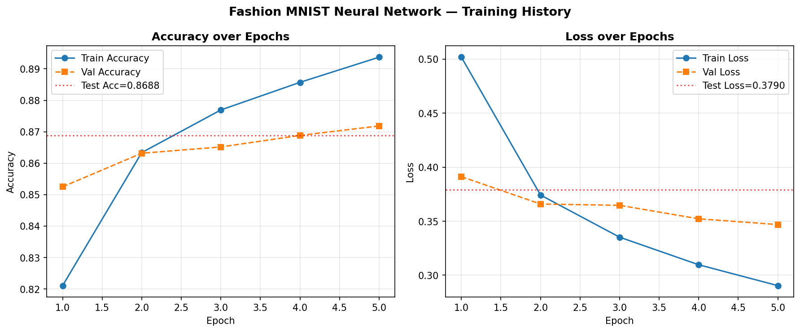
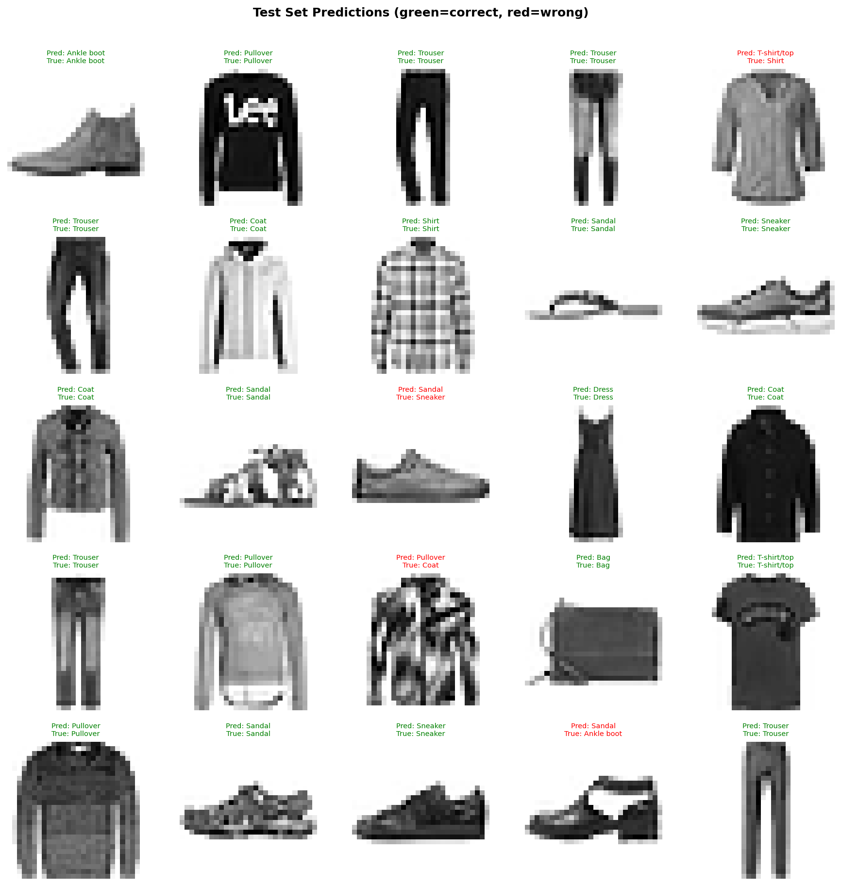
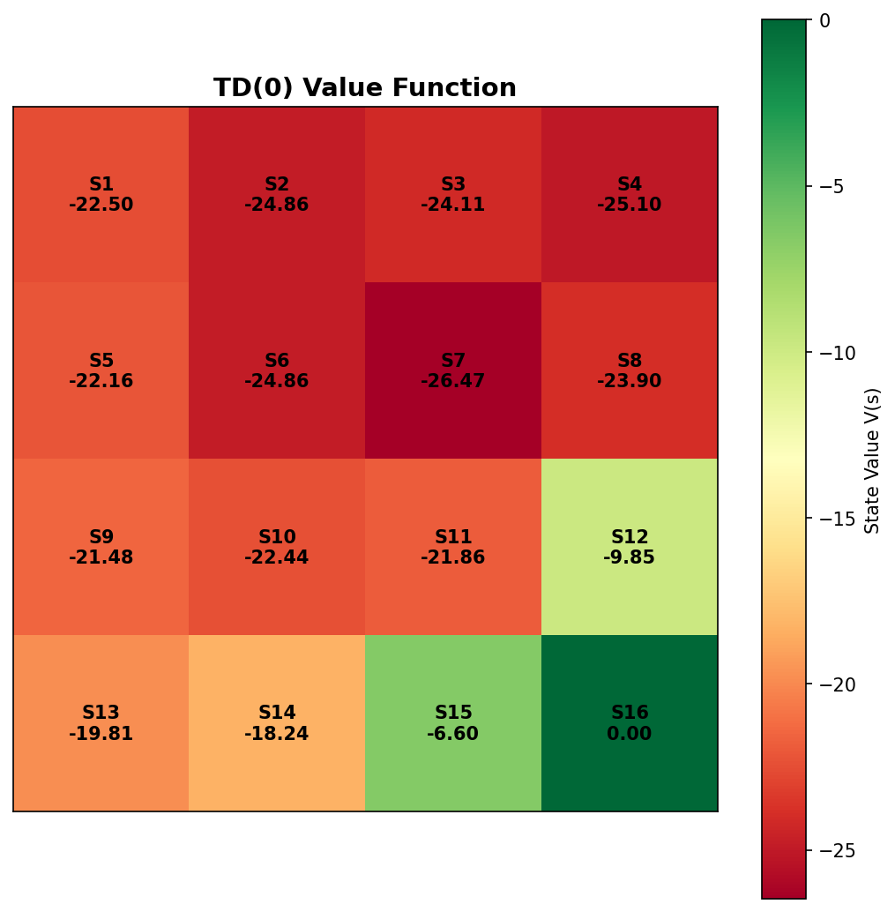
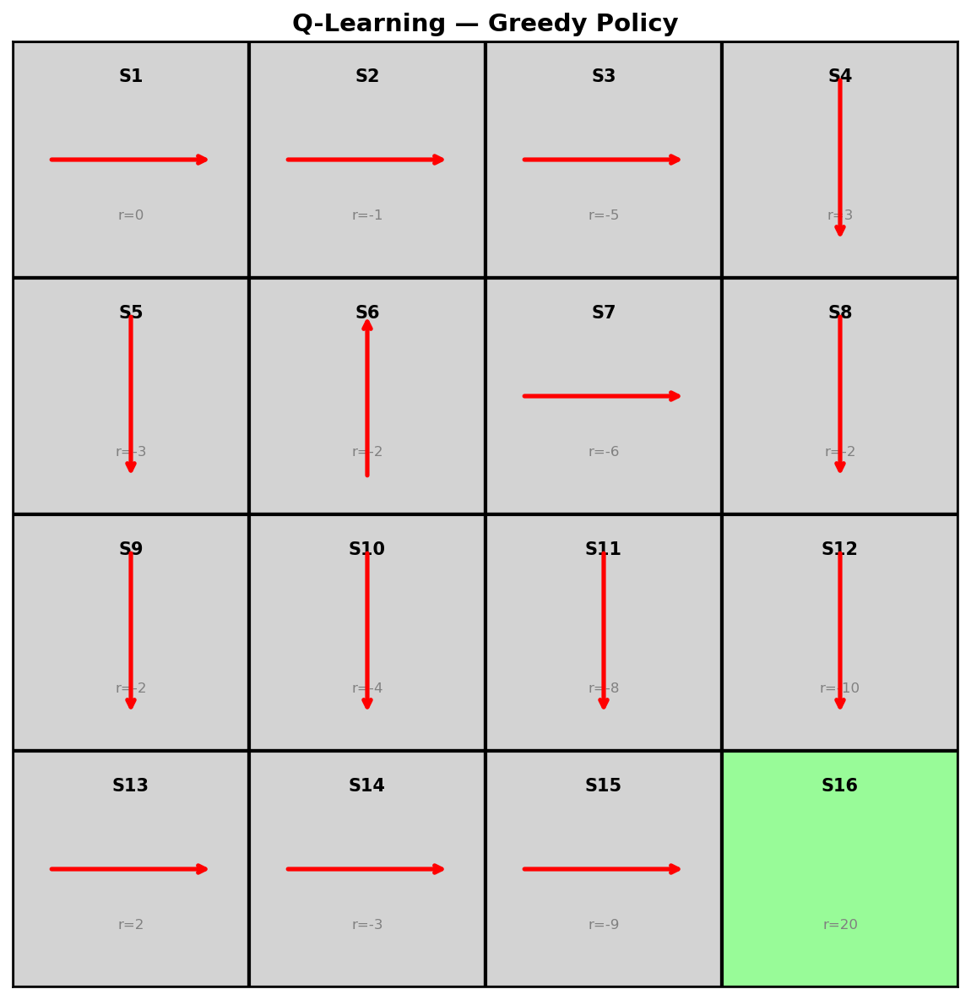
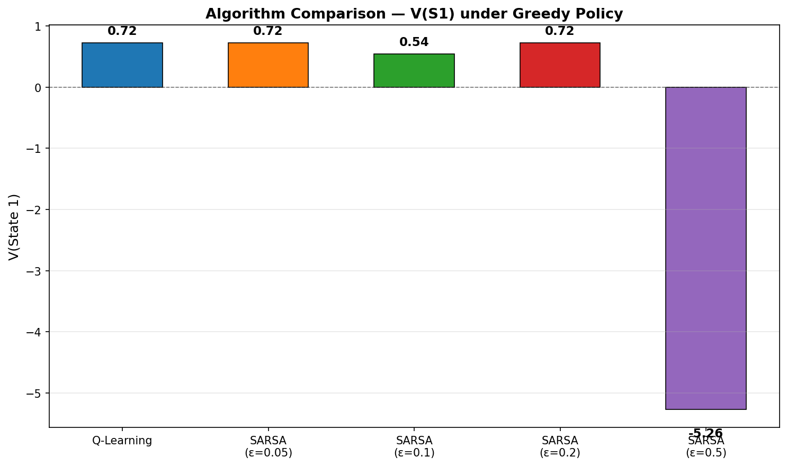

# Statistical Machine Learning — Implementation Portfolio

> End-to-end implementations of core statistical machine learning algorithms from scratch using NumPy, evaluated on benchmark image classification tasks.

---

## Overview

This repository contains rigorous implementations of fundamental supervised learning algorithms, developed as part of a graduate-level Statistical Machine Learning course. Each module covers theoretical foundations, a clean from-scratch implementation, empirical evaluation, and analysis of learning dynamics including convergence behavior and bias-variance tradeoffs.

Modules 01–06 are evaluated on the **MNIST handwritten digit dataset** (binary classification: digit 2 vs. digit 6). Later modules cover clustering (2D data), neural networks (Fashion MNIST), and reinforcement learning (GridWorld).

---

## Repository Structure

```
statistical-ml-portfolio/
├── 01_perceptron/          # Perceptron learning algorithm
│   ├── perceptron.ipynb
│   ├── results/
│   └── README.md
├── 02_knn/                 # k-Nearest Neighbor classifier
│   ├── knn.ipynb
│   ├── results/
│   └── README.md
├── 03_svm/                 # Support Vector Machine (primal, dual, kernel, soft-margin)
│   ├── svm.ipynb
│   ├── results/
│   └── README.md
├── 04_kernel_knn/          # Kernel k-Nearest Neighbor (RBF kernel)
│   ├── kernel_knn.ipynb
│   ├── results/
│   └── README.md
├── 05_bayes_classifier/    # Bayesian binary classifier (MAP rule, Bayes error)
│   ├── bayes_classifier.ipynb
│   ├── results/
│   └── README.md
├── 06_regression/          # Linear regression, logistic regression, model selection, k-fold CV
│   ├── regression.ipynb
│   ├── results/
│   └── README.md
├── 07_clustering/          # K-Means clustering (from scratch, vectorized)
│   ├── clustering.ipynb
│   ├── results/
│   └── README.md
├── 08_neural_network/      # Feedforward NN on Fashion MNIST (TensorFlow/Keras)
│   ├── neural_network.ipynb
│   ├── results/
│   └── README.md
├── 09_reinforcement_learning/  # TD(0), Q-Learning, SARSA on GridWorld
│   ├── reinforcement_learning.ipynb
│   ├── results/
│   └── README.md
├── requirements.txt
└── README.md
```

---

## Modules

| # | Algorithm | Dataset | Key Results |
|---|-----------|---------|-------------|
| 01 | [Perceptron](./01_perceptron/) | MNIST (2 vs 6) | 97.80% test acc · 1 epoch convergence |
| 02 | [k-Nearest Neighbor](./02_knn/) | MNIST (2 vs 6) | Best k=3 · Test Loss = 0.006 |
| 03 | [Support Vector Machine](./03_svm/) | MNIST (2 vs 6) | Hard-margin, dual, RBF kernel, soft-margin C∈{1,3,5} |
| 04 | [Kernel k-NN](./04_kernel_knn/) | MNIST (2 vs 6) | RBF kernel similarity · k∈{3,5} |
| 05 | [Bayes Classifier](./05_bayes_classifier/) | Gaussian generative model | MAP rule · Bayes error = 2.05% |
| 06 | [Linear & Logistic Regression](./06_regression/) | MNIST (2 vs 6) + Polynomial | BGD/SGD · ROC · 10-fold CV |
| 07 | [K-Means Clustering](./07_clustering/) | 2D (hw4_data.mat) | k∈{2,3,4} · 4 inits · Elbow method |
| 08 | [Neural Network](./08_neural_network/) | Fashion MNIST (10 classes) | 86.88% test acc · Adam · 5 epochs |
| 09 | [Reinforcement Learning](./09_reinforcement_learning/) | GridWorld (4×4) | TD(0) · Q-Learning · SARSA ε∈{0.05,0.1,0.2,0.5} |

---

## Result Previews

### 01 — Perceptron

| Convergence | Learned Weights |
|:-----------:|:---------------:|
|  |  |

### 02 — k-Nearest Neighbor


### 03 — Support Vector Machine


### 04 — Kernel k-NN


### 05 — Bayes Classifier


### 06 — Linear & Logistic Regression / Model Selection

| Polynomial Regression | BGD Convergence | ROC Curves |
|:-:|:-:|:-:|
|  |  |  |

> Model selection comparison and cross-validation plots are generated when the full notebook is run (k-SVM sweep required).

### 07 — K-Means Clustering

| k = 2 | k = 3 | k = 4 |
|:-:|:-:|:-:|
|  |  |  |



### 08 — Neural Network (Fashion MNIST)

| Sample Images | Training History | Test Predictions |
|:-:|:-:|:-:|
|  |  |  |

### 09 — Reinforcement Learning (GridWorld)

| TD(0) Value Function | Q-Learning Policy | Algorithm Comparison |
|:-:|:-:|:-:|
|  |  |  |

---

## Key Technical Highlights

- **Perceptron**: Online update rule with augmented feature space (784-dim + bias), convergence in a single epoch.
- **k-NN**: Vectorized distance computation with `np.argpartition` for O(n) neighbor selection; bias-variance analysis across k.
- **SVM**: Full pipeline — primal SLSQP, Lagrangian dual, Gram matrix kernel trick, and soft-margin C-SVM with slack variables.
- **Kernel k-NN**: Vectorized RBF kernel matrix via broadcasting; implicit RKHS feature comparison without explicit feature maps.
- **Bayes Classifier**: Analytical MAP decision rule derivation for Gaussian generative model; Bayes error rate computed via numerical integration.
- **Linear & Logistic Regression**: GD trace, polynomial overfitting analysis, BGD vs SGD comparison with ROC curves and AUC, 10-fold cross-validation for σ selection.
- **K-Means Clustering**: Vectorized distance computation via squared-norm expansion; initialization sensitivity analysis across k∈{2,3,4} and 4 random seeds; elbow method for k selection.
- **Neural Network**: Feedforward architecture (784→128→64→10) trained with Adam on Fashion MNIST; training/validation history with 86.88% test accuracy; per-class prediction visualization.
- **Reinforcement Learning**: TD(0) value estimation under random policy; Q-Learning (off-policy) and SARSA (on-policy, ε-greedy) on 4×4 GridWorld; comparison of V(S1) across algorithms and ε values.

---

## Setup

```bash
git clone https://github.com/Prodholly/statistical-ml-portfolio.git
cd statistical-ml-portfolio
pip install -r requirements.txt
```

Then open any module notebook:

```bash
jupyter notebook 01_perceptron/perceptron.ipynb
```

---

## Dependencies

| Package | Purpose |
|---------|---------|
| `numpy` | Numerical computation |
| `matplotlib` | Visualization |
| `tensorflow` | MNIST / Fashion MNIST dataset loader; neural network (module 08) |
| `scipy` | `.mat` file loading (module 07) |
| `jupyter` | Notebook environment |

---

## Author

**Emmanuel** · [@Prodholly](https://github.com/Prodholly)
